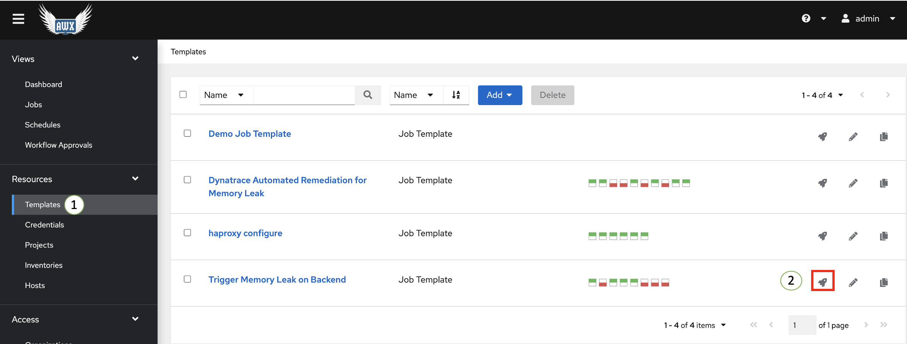
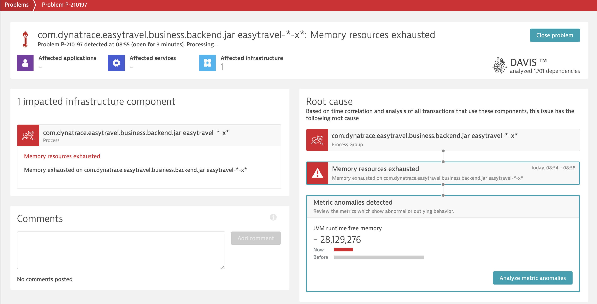
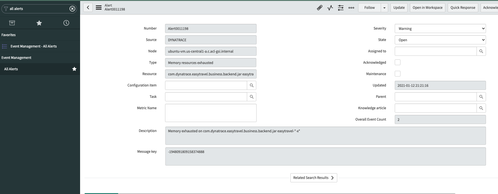
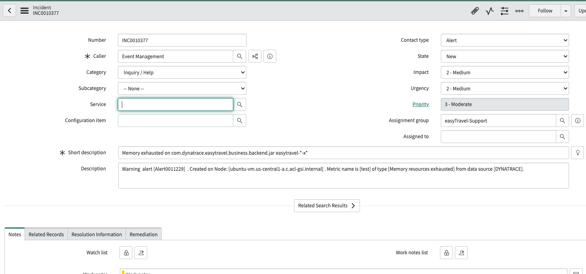
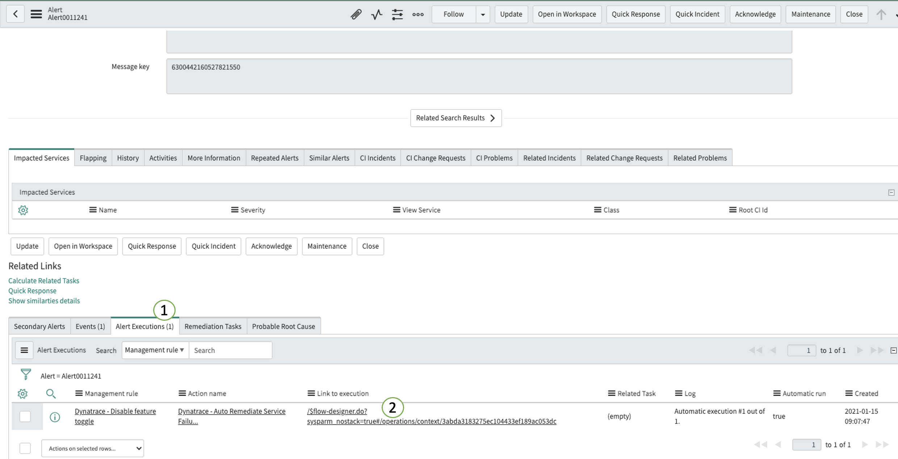
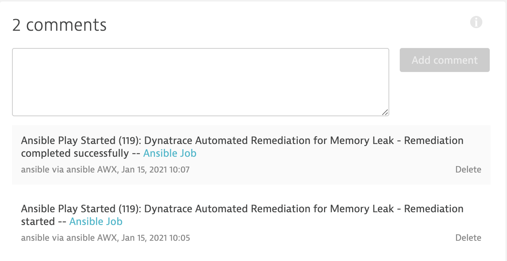
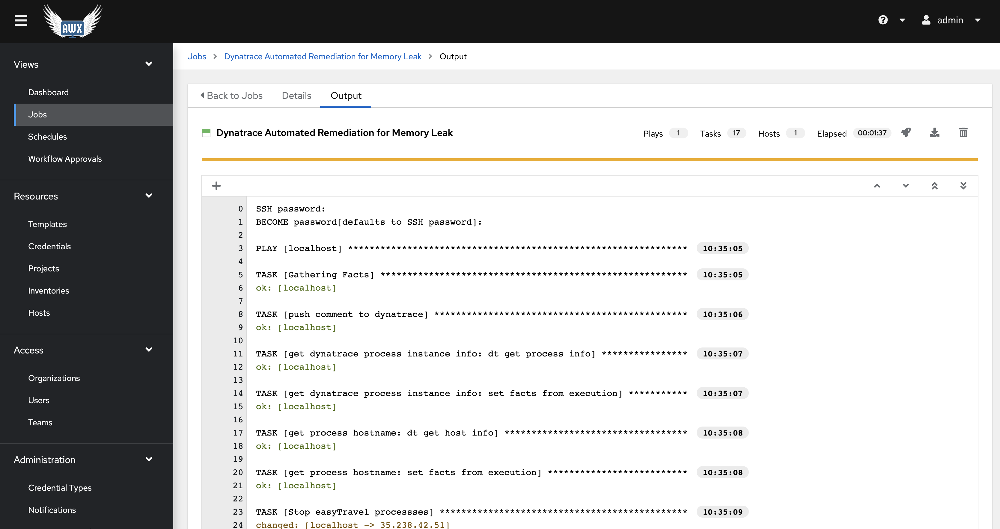
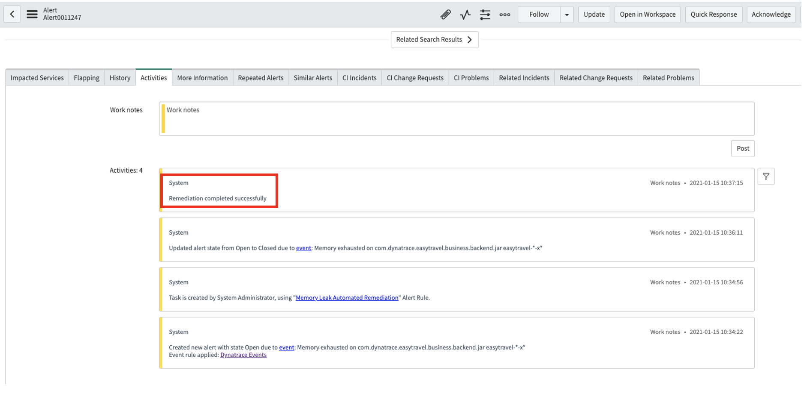
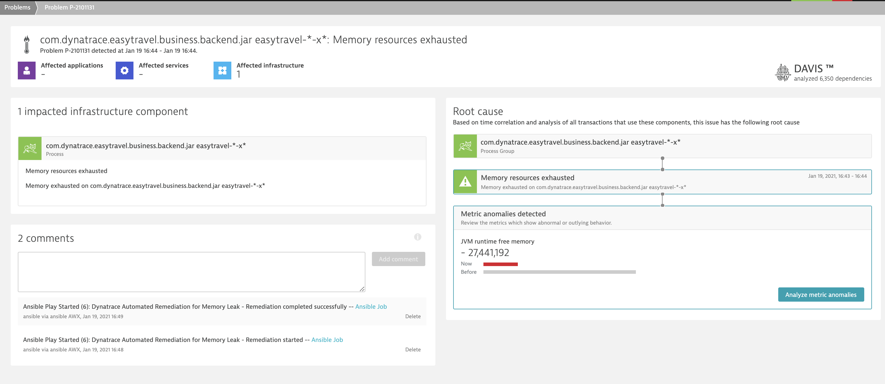

## Trigger Remediation

In this lab we will trigger the ansible AWX template called `Trigger Memory Leak on Backend` that will enable the `MediumMemoryLeak` easyTravel plugin which will result in a memory exhaustion problem detected and generated by dynatrace.

### Trigger problem

1. In Ansible AWX, navigate to `Templates` and click on the "rocket" icon next to the template named `Trigger Memory Leak on Backend`.

    

1. the `MediumMemnoryLeak` problem pattern should be enabled on the easyTravel management portal:

    

1. After a few minutes a new problem will be created on dynatrace:

    

1. A new Alert will also be created on ServiceNow:

    

1. There will be an Incident attached to the alert with the `Assignment group` among other fields already populated:

    

### Watch automated remediation trigger

1. You can check the status of the flow execution by going to the `alert executions tab` on the bottom of the alert and clicking on the triggered remediaton subflow:

    

1. During he remediaton execution, ansible AWX will add comments to the dynatrace problem comments:

    

1. You can click on thea `Ansible Job` link to view hte exexution of the template on ansible AWX.

    

1. The ServiceNow Alert work notes will also be updated by the remediation subflow depending on the status of the remediaton executed by ansible AWX:

    

1. After a successful remediation execution, the problem should automatically close on dynatrace:

    

### Load Balancer Role

During the remediation process, the HAProxy is configured to only route traffic to healthy endpoints, meaning that any instances of the easyTravel application that are down due to remediation the execution, won't receive any traffic. This ensures that the auto-remediation process does not affect the availability of the application.
